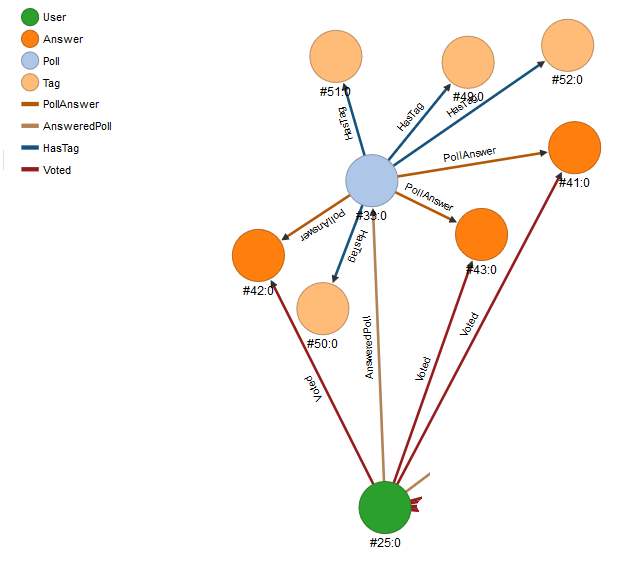
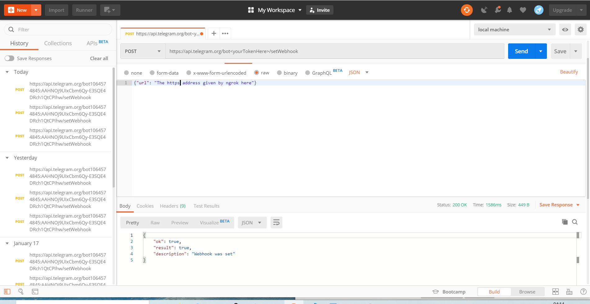

Caduff Max, Thomas Benjamin

# 
 MAC Project 

## Telegram majority judgement bot

### Purpose
This bot implements the [majority judgement](https://en.wikipedia.org/wiki/Majority_judgment) (MJ), which is a still-not-perfect-but-better voting system than traditional "which is the best". MJ allows to rate each option with a grade from bad to excellent, and uses the median and some computations to choose the option best liked by most.

### Specification

* be able to create a poll, public or private, with a question and options to evaluate
* be able to share the poll with a specific audience
* be able to vote and change your vote
* ability to obtain statistics on polls
* be able to search public polls, or retrieve the most recent or popular

### Constraints

* a private poll can only be visible by the people to whom he has been shared with
* everyone can vote once in a poll that is accessible to them

### Choice of technologies

__Mail client__: Telegram, which has a rich API for managing bots.

__Database__: OrientDB, graph database, allowing you to easily manage the links between surveys, users and responses.

__Server back end__: Express, which allows you to create a javascript server responding to requests.

### User interaction
The bot is initiated with the command "/start". This registers the user in the database and allows to create and answer polls.

Users can create a poll with the command "/create. They are then prompted to choose privacy parameter, some tags if the poll is public, write the question and the answers options.  
When entering tags, if close existing tag are found, the user is asked if he wants to use one of them or create his.

Polls can be public or private. Public polls are searchable by everyone (with the help of tags and keywords), private polls must be shared with a user or a group to allow them to see it and participate. After answering a poll, the user decides if his vote is anonymous or not (names will be displayed or just the number of answers).

Users can access their different created polls by typing the command "/mypolls", the 5 last created polls are returned, with a button to fetch next if any. (hack: you can directly access page N with /mypollsN, 0 being the first)

Polls must be closed prior to see the results. Only the creator can close the poll. A future update could implement a delay after which the poll automatically closes. When the poll is closed, a message with the results is sent by the bot to each participants.  
Sharing a closed poll also sends results.

Searching polls will be possible by typing @BestOptionBot \<query\>, with filtering keywords starting with # and free terms matched against tags and poll's question. (We could use #tag, #question and #option to look specifically into those fields, type #latest, #oldest or #popular to find polls corresponding to these criteria)

Actually votes being anonymous or not is useless, we could implement a button along the results to display an editable message with statistics and public voters for each option.

In the future, the creator might also be able to change the five ratings that the users use to rate choices. Actually, only preset choices are available (bad, poor, fair, good, excellent, no opinion).

### Implementation

All queries and messages to the bot are sent via a webhook to a fixed url. To get those we use the help of ngrok who redirects a local port to a generated subdomain on their server. Responses and updates sent by the bot are transmitted to a telegram address containing the api key of the bot and a specific path.

Poll creation and voting process are taking multiple iterations, so those states are kept between queries in 2 maps with the user's telegram id as key and containing all useful infos. The maps themselves are saved on the disk when the server exits, and are loaded on start.

Updates sent by telegram are json objects with different fields depending on the source of the update. We handle 3 types of queries:   

- Messages sent by a user, directly or with a click on a non-inline keyboard (which sends its content as message and disappears). They can be commands (/cmd) or free text.
- Inline queries (@BotName ...), sent each time the user changes the input, giving an easy way to show the user one ore more results in a responsive way. If the user clicks on one of the displayed results, it will be sent as a message.
- Callback queries, sent by a click on an inline keyboard (persistant keyboard attached to a message), containing the message to which it was attached except for messages sent via inline queries results.

The poll creation process is handled with simple messages, since the input is mainly free, storing the new informations provided by the user in the creationState map along the process. Input is checked at each step of the process so the poll is in a valid state when the user finishes. Only at this moment the poll is created in the database. New tags are matched against existing to guarantee uniqueness.

The voting process is handled with callback queries, those sending exactly the input associated with the keyboard button clicked, only state consistency checks are needed (no user input). On a vote request, the associated message is edited with the current answer to evaluate and the keyboard displays the rating scale. When the user chooses a grade, the vote is recorded in an array and the next option is displayed. When the process is complete, if the user already voted his votes are updated, otherwise they are created and the message is refreshed with the default keyboard.

Sharing polls can be done only with inline queries allowing users to post a message via the bot. When clicking on a share button, the poll's id is inserted in the query so the user only has to click the result to display it in the selected chat. Since messages are visible by everyone in a group, a button redirecting the user to a chat with the bot allows him to vote. This button has a start parameter indicating the poll; since the command is /start, the user is also registered in the database.

Searching for polls (not available yet) could be implemented with standard messages, but it would result in a lot of long messages, inline queries allows to display multiple results without polluting the chat and to send any result in any chat.

### Data Model

We opted for this model because it seemed to us to correspond best to the schema to which we wanted to structure our data. Indeed, it seemed logical to us to represent the users, the polls, the options, as well as the tags that we added in order to facilitate searches, as vertices. Everything else is only after relationships between the vertices, each of the edges representing a link between a user and a poll, a tag and a poll, a user and an answer, etc...

### Advanced queries

Advanced queries are performed by recursion. The #s allow you to enter search criteria such as the latest or most popular polls.
#oldest, #latest and #popular define an order in which to order the returned polls and #tag, #option, #question as well as the free search looks for a match with the terms. In order to ensure results, we opted for OR queries, except for the #question query which is considered a phrase query.
It was necessary to group the polls by @rid in order to ensure correct results due to the potential recovery of the variable count (in (AnsweredPoll)) (the number of people who answered a given poll).

### Launch steps

* start orientDb: you can either use docker or a local install (see [orientDb docs](https://orientdb.com/docs/last/Tutorial-Installation.html)).
* launch the database creation script, either with the console or execute the content with the web interface provided by orientDb.
* start ngrok to redirect your port 8080 (`$ ngrok http 8080`)
* set the new ngrok address for the webhook e.g. with postman (see [Telegram API](https://core.telegram.org/bots/api#setwebhook))  
from the backend folder:

* get your api key from [Botfather](https://t.me/botfather) and set it (`$ echo 'yourKey' > apiKey`), you thought I'd give mine? =p
    - For that contact BotFather and type the command `/newbot`
    - Follow the instructions
    - Enable the inline queries by typing the command `/mybots`
    - Choose your bot, the bot settings button and then the inline mode.
    - Turn it on and add a placeholder "search..."
* if necessary, create the two empty JSON files creationSateBackup.json and voteStateBackup.json containing only `[]`
* change the botName variable by your bot username
* launch the express server : `$ npm install; npm start`. Alternatively to npm start, `$ npm run dev` launches nodemon which reloads on changes.
